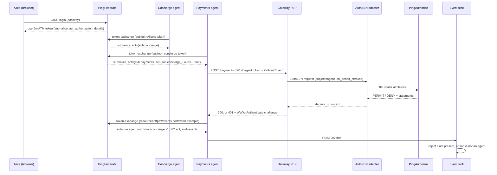

# Token exchange: nest and flatten

This document describes how the demo issues delegated agent tokens in PingFederate, and
how PingAuthorize evaluates those tokens through the AuthZEN adapter.

Written 2026-07-20 against the configuration in `demo/pingfederate/terraform/`,
`demo/pingfederate/data.zip`, `demo/coaz-pep/`, `authzen-adapter/`, and
`demo/pingauthorize/banking.deploymentpackage`.

---

## 1. Two kinds of token

PingFederate issues two different kinds of token from the same token exchange processor
policy (`userToAgentTE`). This document calls them the banking token and the events
token.

| | Banking token (nest) | Events token (flatten) |
|---|---|---|
| `sub` | `alice`, the human user | `urn:agent:northwind-concierge:v1`, an agent |
| `act` | nested agent chain | not present |
| `aud` | `https://api.northwind.example/bank` | `https://events.northwind.example` |
| ATM | `attestJwtPmts` / `attestJwtAcct` / `attestJwtATM` | `eventsFlatJwtATM` |
| Lifetime | 720s | 120s |

Both kinds are issued by the same issuer, from the same processor policy, using the same
subject token. The `resource` parameter in the exchange request (RFC 8707) determines
which of the two PingFederate returns.

The `sub` claim therefore means different things in the two tokens. In a banking token
`sub` is the human user. In an events token `sub` is an agent. A resource server that
reads `sub` without also checking `aud` will treat an agent as if it were the human user.
The event sink checks both (`demo/event-sink/app.py`).

---

## 2. Flow



---

## 3. The nest (delegation chain)

### Token processor

`demo/pingfederate/terraform/token-exchange.tf:24-48` defines `subjectJwtProc`, a
`JWTTokenProcessor`. It validates the inbound PingFederate token against
`http://localhost:9080/pf/JWKS` with `Expiry Tolerance = 0`.

```hcl
attribute_contract = {
  core_attributes     = [{ name = "sub" }]
  extended_attributes = [{ name = "acr" }, { name = "scope" }, { name = "act" }]
}
```

This processor is the only place where an inbound `act` claim enters PingFederate.

### Token exchange processor policy

`token-exchange.tf:51-80` defines the policy. `actor_token_required` is `false`.

```hcl
attribute_contract = { extended_attributes = [{ name = "act" }] }

processor_mappings = [{
  subject_token_type      = "urn:ietf:params:oauth:token-type:access_token"
  subject_token_processor = { id = subjectJwtProc }
  attribute_contract_fulfillment = {
    "subject" = { source = { type = "SUBJECT_TOKEN" }, value = "sub" }
    "act"     = { source = { type = "SUBJECT_TOKEN" }, value = "act" }
  }
}]
```

In the deployed XML in `data.zip`, `actorTokenType` and `actorTokenProcessorId` are both
empty strings. No RFC 8693 `actor_token` is presented on any request. PingFederate
identifies the actor from the authenticating client instead of from a second token.

### The mapping that produces `act`

`token-exchange.tf:110-116`:

```hcl
"act" = {
  source = { type = "TEXT" }
  value  = "{\"sub\":\"${var.agent_payments}\",\"act\":{\"sub\":\"${var.agent_concierge}\"}}"
}
```

The resulting token contains `sub=alice`, `act.sub=payments` and
`act.act.sub=concierge`.

This value is a fixed string. It is not calculated from the incoming token. The processor
policy does expose the inbound `act` as `tepp.act`, and the policy passes it through, but
no mapping reads it. If a payments token were issued directly from Alice's login token,
the `act` claim would still say the request came through the concierge.

No `act` value on either the payments or the account mapping is calculated at runtime.
Both are fixed strings.

---

## 4. The flatten

### 4a. The OGNL expression that was written but is not used

`demo/pingfederate/terraform/flatten.tf:52-62`:

```hcl
root_actor_ognl = trimspace(<<-EOT
  (#a = (#this.get("act") == null ? "" : #this.get("act").getValue()),
   #k = "\"sub\":\"", #i = #a.lastIndexOf(#k),
   #i < 0 ? "" : #a.substring(#i + #k.length(), #a.indexOf("\"", #i + #k.length())))
EOT
)
```

The expression reads `act` as a raw JSON string, finds the last occurrence of the literal
text `"sub":"`, and returns the value up to the next quote character. Because each level
of nesting places the earlier actor deeper in the structure, the last `"sub"` in the
serialized string is the first agent in the chain.

No resource references `local.root_actor_ognl`. No resource references
`local.act_expression` (`token-exchange.tf:87`) either, which is the equivalent
expression for building the nested `act`. Both remain in the file as a record of the
approach that was originally intended.

The expression depends on whitespace, key ordering and escaping in the serialized JSON,
so it can break if any of those change. That is why the alternative in section 4d was
built.

### 4b. What is actually deployed

`flatten.tf:64-83`:

```hcl
resource "pingfederate_oauth_access_token_mapping" "te_events" {
  context = {
    type        = "TOKEN_EXCHANGE_PROCESSOR_POLICY"
    context_ref = { id = pingfederate_oauth_token_exchange_processor_policy.user_to_agent.policy_id }
  }
  access_token_manager_ref = { id = pingfederate_oauth_access_token_manager.events.manager_id }

  attribute_contract_fulfillment = {
    "sub"       = { source = { type = "TEXT" },    value = var.agent_concierge }
    "client_id" = { source = { type = "CONTEXT" }, value = "ClientId" }
    # No "act" fulfillment.
  }
```

Two things produce the flattened token:

1. `sub` is set to the fixed string `urn:agent:northwind-concierge:v1`.
2. The attribute contract for `eventsFlatJwtATM` (`flatten.tf:38-44`) contains only `sub`
   and `client_id`. There is no `act` attribute, so the token manager cannot emit an
   `act` claim regardless of what the request contains.

The processor policy passes `tepp.act` through, and the mapping then discards it.

The deployed form, from `oauth-authz-server-settings.xml` inside `data.zip`:

```xml
<urn:UserKeyToAccessTokenMapping
    contextId="urn:ietf:params:oauth:grant-type:token-exchange|userToAgentTE"
    tokenManagerId="eventsFlatJwtATM">
  <urn1:AttributeMap Name="sub" Type="Text">
    <urn1:ValueText>urn:agent:northwind-concierge:v1</urn1:ValueText>
  </urn1:AttributeMap>
  <urn1:AttributeMap Name="client_id" Type="Context">
    <urn1:ValueText>context.ClientId</urn1:ValueText>
  </urn1:AttributeMap>
  <urn1:TokenAuthorizationIssuanceCriteria>
    <urn1:TokenAuthorizationIssuanceCriterion ErrorResult="attestation_validation_failed">
      <urn1:ExprText>@com.pingidentity.ps.oidf.servlet.clientregistration.utils.ClientAttestationUtils@validateClientAttestation(#this)</urn1:ExprText>
    </urn1:TokenAuthorizationIssuanceCriterion>
  </urn1:TokenAuthorizationIssuanceCriteria>
</urn:UserKeyToAccessTokenMapping>
```

### 4c. How the flatten is selected and restricted

The agent requests the flattened token in `demo/task-agent/identity.py:384-433`:

```python
edata = {
    "grant_type": "urn:ietf:params:oauth:grant-type:token-exchange",
    "subject_token": subject_token,
    "subject_token_type": "urn:ietf:params:oauth:token-type:access_token",
    "resource": EVENTS_AUDIENCE,   # selects the events ATM, and therefore the flatten mapping
    "client_id": agent_id,         # public client; attestation is the credential
}
```

`demo/task-agent/app.py:245` calls this after a payment succeeds.

PingFederate matches the `resource` value against the `resource_uris` list on
`eventsFlatJwtATM`, which contains `["https://events.northwind.example"]`.

One setting controls which clients can obtain a flattened token. On the payments client
only, `generated_adopt.tf:82` sets:

```hcl
restrict_to_default_access_token_manager = false
```

The concierge client (`generated_agents.tf:82`) and the account client
(`generated_agents.tf:173`) set this to `true`. Those clients cannot reach the flatten
token manager even if they send the `resource` parameter. This single setting is the only
control over which clients can flatten.

The receiving service checks the result. `_verify_flattened()` in
`demo/event-sink/app.py:48` rejects a token that still carries an `act` claim, and
rejects a token whose `sub` is not an agent URN (lines 79-92).

### 4d. The policy-based alternative, built and tested but not connected

`demo/pingfederate/terraform/paz-audience-flatten.md:40-57` describes a second approach.

A PingAuthorize policy in the sibling repository `dphhyland/idp-paz-simplifid-policy`
(`pap-profile/policies/AuthZEN.snapshot`) adds a `TokenExchange` trust framework domain
and a policy named "Event-endpoint flatten governance":

- combining algorithm `DenyUnlessPermit`
- condition: `requestedAudience == https://events.northwind.example`
- the rule permits when `requestingClient == urn:agent:northwind-payments:v1`

Three decision tests are recorded. A request for the events audience from the payments
client returns PERMIT. The same request from the account client returns DENY. A normal
banking request with no audience returns NOT_APPLICABLE, because the audience attribute
has `defaultValue=""` and so the rule cannot affect ordinary banking requests under
`DenyOverrides`.

Under this approach the agent proposes the root actor and PingAuthorize decides whether
the flatten is allowed for that audience. The deployed `te_events` mapping still uses the
fixed string described in 4b, so this approach is not currently in use.

---

## 5. Access token managers

All JWT token managers use `JwtBearerAccessTokenManagementPlugin` with RS256, the
centralized signing key, and `typ: at+jwt`.

| ATM | Source | Contract | `aud` | TTL |
|---|---|---|---|---|
| `userJwtATM` | data.zip only | `sub, acr, auth_time, name, client_id` | none | 28800 |
| `attestJwtATM` | data.zip only | `sub, act, client_id` | none | 720 |
| `attestJwtPmts` | `generated_adopt.tf:289` | `sub, act, client_id` | `.../bank` | 720 |
| `attestJwtAcct` | `generated_adopt.tf:96` | `sub, act, client_id` | `.../bank` | 720 |
| `eventsFlatJwtATM` | `flatten.tf:17` | `sub, client_id` | `.../events` | 120 |

The `acr` claim appears only on `userJwtATM`, which is the token issued when a human logs
in. It reaches the PDP in the separate `X-User-Token` header rather than in the agent
token.

`userJwtATM` is not managed by Terraform. It exists only in `data.zip`, so its
configuration can differ from the declared configuration without that difference being
detected.

---

## 6. Attestation

All agent clients set `client_auth = { type = "NONE" }` and
`grant_types = ["TOKEN_EXCHANGE"]`. There is no client secret. Client attestation is the
credential.

`variables.tf:56-60` and `token-exchange.tf:91-95` define the criterion:

```hcl
attestation_criterion = "@${var.attestation_utils_class}@validateClientAttestation(#this)"
```

which resolves to:

```
@com.pingidentity.ps.oidf.servlet.clientregistration.utils.ClientAttestationUtils@validateClientAttestation(#this)
```

PingFederate applies this as a token authorization issuance criterion on `te_payments`,
`te_account`, `te_events` and the three `client_credentials` mappings, with
`ErrorResult="attestation_validation_failed"`.

The implementation is a prebuilt jar, `demo/pingfederate/pf-oidf-modules.jar`. It reads
the `OAuth-Client-Attestation` and `DPoP` headers and verifies the attester-signed JWT
and its `cnf` binding. The trusted attester keys are in
`demo/pingfederate/oidf-mock-attesters.json` as ES256 P-256 JWKs indexed by client id.

`signupTE`, `te_signup` and the ROPC, CIBA and HTML-form mappings have no attestation
criterion.

A second jar, `pf.plugins.pf-rar-paz-plugin.jar`, provides an
`AuthorizationDetailProcessor` named `rarPazProc`. It calls PingAuthorize from the
authorization endpoint for `payment_initiation` RAR requests. It is not part of the token
exchange path.

---

## 7. PDP integration

### Pipeline

```
JWT claims
  -> PEP decodes the token and selects claims
  -> AuthZEN request (subject / action / resource / context)
  -> authzen-adapter converts the request to flat scalar attributes
  -> PingAuthorize governance engine
  -> Symphonic rules read the attributes through "request" resolvers
  -> decision + statements
  -> adapter converts statements to AuthZEN context
  -> PEP converts context to an HTTP or JSON-RPC challenge
```

PingAuthorize does not receive the token, the AuthZEN request object, or the actor chain.
It receives about 14 flat scalar attributes that the adapter calculates.

### Claim extraction

`demo/coaz-pep/cmd/coaz-pep/jwt.go:153-172`:

```go
func actorSub(claims map[string]any) string {
	act := claims["act"]
	if s, ok := act.(string); ok {          // PF's JWT ATM emits object claims as strings
		var decoded map[string]any
		if json.Unmarshal([]byte(s), &decoded) == nil {
			act = decoded
		}
	}
	if m, ok := act.(map[string]any); ok {
		sub, _ := m["sub"].(string)
		return sub
	}
	return ""
}
```

The function returns `act.sub` and does not read any deeper. No PEP reads `act.act`, and
`act.act` never reaches PingAuthorize.

The function handles both a string and an object because PingFederate's JWT token manager
serializes object-valued claims as strings. `claimsForCEL` (`jwt.go:135-151`) performs the
same re-parse so that `token.act.sub` resolves in CEL regardless of how the claim was
encoded.

### Subject inversion

`demo/coaz-pep/cmd/coaz-pep/pep.go:317-338`:

```go
agent := act
if agent == "" { agent = clientID }
if agent == "" { agent = "unknown-agent" }

authzenReq := map[string]any{
	"subject": map[string]any{
		"type":     "agent",
		"identity": agent,
		"properties": map[string]any{
			"on_behalf_of": sub,
			"agent_type":   "ai_assistant",
			"scope":        scope,
			"client_id":    clientID,
		},
	},
	"action":   map[string]any{"name": m.action},
	"resource": map[string]any{"type": m.rtype, "id": m.rid, "properties": m.rprops},
	"context":  m.ctx,
}
```

In the token, `sub` is Alice and `act.sub` is the agent. In the AuthZEN request the agent
becomes the subject, and Alice is moved to `subject.properties.on_behalf_of`. These two
fields are the only record of the delegation in the request sent to the PDP.

The key is `identity`, not the AuthZEN 1.0 name `id`. The adapter accepts both keys
(`authzen-adapter/authzen-pdp.go:32-59`).

The MCP edge builds the same request structure using CEL, so the same policies apply to
both edges. `demo/mcp-server/server.py:160-172`:

```python
_AGENT_EXPR = ("has(token.act) ? token.act.sub : "
               "(has(token.client_id) ? token.client_id : 'unknown-agent')")
```

### Context injection

The PEP reads claims from two different tokens and combines them into one context object.
`pep.go:294-314`:

```go
uclaims := jwtClaims(headers["x-user-token"])
m.ctx["user_scope"] = scopeString(uclaims)
m.ctx["token_aud"]  = audString(claims)      // from the AGENT token
m.ctx["user_acr"]   = strClaim(uclaims, "acr")
if ad, ok := uclaims["authorization_details"]; ok && ad != nil {
	m.ctx["authorization_details"] = ad
	if amt, cred, found := consentedPayment(ad); found {
		m.ctx["consented_amount"] = amt
		m.ctx["consented_creditor"] = cred
	}
}
```

`token_aud` comes from the agent token. `user_scope`, `user_acr` and
`authorization_details` come from Alice's token in the `X-User-Token` header.

Both PEPs must build this context in the same way. The comment in the code describes what
happens otherwise: a payment that was authorized at the MCP edge is challenged again at
the bank API edge because the RAR context is missing, the payment then fails downstream,
and the flow repeats the step-up indefinitely.

`consentedPayment` (`pep.go:473-491`) reads only the first `payment_initiation` entry in
the authorization details.

### Adapter flattening

`authzen-adapter/authzen-pdp.go:513-534` writes flat scalar attributes in addition to the
nested JSON-string attributes. The banking policy reads only the flat scalars.

```go
pdpPayload.Attributes["actionName"]   = evalRequest.Action.Name
pdpPayload.Attributes["resourceType"] = evalRequest.Resource.Type
pdpPayload.Attributes["resourceId"]   = evalRequest.Resource.ID
pdpPayload.Attributes["agentId"]      = evalRequest.Subject.ID
// ... to_account, onBehalfOf, agentType, then context scalars
```

### Precalculated booleans

`authzen-pdp.go:583-604`:

```go
// The embedded PDP (PingAuthorize 11.0.0.2) cannot compare two attributes to each other,
// so we do the amount/account match here and hand the policy plain booleans.
amtOK  = cap > 0 && amt <= cap
credOK = cred != "" && toAcct == cred
pdpPayload.Attributes["rar_amount_ok"]   = strconv.FormatBool(amtOK)
pdpPayload.Attributes["rar_creditor_ok"] = strconv.FormatBool(credOK)
```

The adapter performs the RAR consent comparison in Go because PingAuthorize 11.0.0.2
cannot compare one attribute to another. The policy receives the results as booleans. The
adapter also forwards `authorization_details` itself, but no rule reads it.

The mDL gate works the same way (`:606-633`). The adapter calls the proofing directory
and sends the policy `identity_proofing_present` as the string `"true"` or `"false"`.

The adapter sends these attributes, and no rule reads any of them: `agentId`,
`agentType`, `channel`, `resourceType`, `resourceId`, `authorization_details`,
`consented_amount`, `consented_creditor`, and the four nested JSON-string attributes.

---

## 8. Policy

### Lineage

The deployed package is `banking-mdl-gate`
(`demo/pingauthorize/banking.deploymentpackage`, snapshot
`0f166055-5682-4bf4-bd24-26a354eb0f04`, applicationVersion 11.1.0.0). Its root entity is
`Global Decision Point`.

The previous package is `banking-staff-approval`
(`banking.deploymentpackage.pre-mdl-gate.bak`, snapshot `e37ad2da-...`), whose root entity
is `Agentic Banking Authorization`.

The source snapshot is checked in as `demo/pingauthorize/banking-mdl-gate.snapshot`.

Authoring on the wrong lineage removes the mDL gate without any error being reported.
Changes must target `banking-mdl-gate`, and the result must be checked with a decision
test.

### Structure

```
PolicySet "Global Decision Point"        DenyOverrides
  └── Policy "Agentic Banking Authorization"   DenyOverrides, evaluateAll: false
        └── 7 rules, no targets, no policy-level condition
```

### Trust framework

There are 13 attributes. Each one uses `attributeResolverType: "request"` with
`parametersKey == name` and `condition: {"empty": {}}`, so each reads one of the
adapter's flat attributes directly.

| Attribute | Type | Default |
|---|---|---|
| `actionName` | STRING | `""` |
| `amount` | NUMBER | `0` |
| `currency` | STRING | `""` |
| `onBehalfOf` | STRING | `""` |
| `to_account` | STRING | `""` |
| `token_aud` | STRING | `""` |
| `user_acr` | STRING | `""` |
| `user_scope` | STRING | `""` |
| `rar_amount_ok` | STRING | `"false"` |
| `rar_creditor_ok` | STRING | `"false"` |
| `identity_proofing_present` | STRING | `"true"` |
| `purpose` | STRING | `""` |
| `consent_covered` | STRING | `"false"` |

The defaults fail in two different directions, and both are intentional. `rar_amount_ok`,
`rar_creditor_ok` and `consent_covered` default to `"false"`, so a missing consent causes
a step-up. `identity_proofing_present` defaults to `"true"`, so the origination rule does
nothing while the proofing gate is switched off.

There is one PIP, `ServiceDefinition "ConsentDirectory"`. It is a RESTful GET with no
authentication, a 2000 ms timeout, and 2 retries with backoff:

```
https://proofing-directory-staging.up.railway.app/consents/check
    ?subject={{onBehalfOf}}&creditor={{to_account}}&amount={{amount}}&currency={{currency}}
```

It sets `consent_covered` from `$.covered` in the response, and it runs only when
`actionName == "make_payment"`.

`onBehalfOf` and `to_account` are used only to build this URL. No rule reads either
attribute directly.

### Rules

1. **Permit banking actions.** Unconditional permit when `actionName` is one of
   `list_accounts`, `get_balance`, `open_account`, `make_payment` or `access_mcp`.

2. **Deny over-limit agent payment.** `actionName == "make_payment" AND amount > 2000`.

3. **Permit payment authorization.** `purpose == "payment_initiation"`. This rule applies
   to the PingFederate token issuance path through `rarPazProc`, not to the gateway path.

4. **Deny over-limit payment authorization.** `purpose == "payment_initiation" AND
   amount > 2000`.

5. **Require step-up for large payment.** Denies and returns the `step-up-required`
   statement:

   ```
   actionName == "make_payment"
   AND amount > 500
   AND NOT (amount > 2000)
   AND NOT (
        (rar_amount_ok == "true" AND rar_creditor_ok == "true")     # (a) RFC 9396 RAR
     OR (user_acr == "urn:northwind:loa:staff-approval"
         AND user_scope CONTAINS "banking:payments:transfer")       # (b) CIBA staff channel
     OR (consent_covered == "true")                                 # (c) consent directory
   )
   ```

   Any one of three approval channels satisfies the rule. Channel (a) is the interactive
   channel, where the payment details are carried in the token as RAR. Channel (b) is the
   autonomous channel: PingFederate cannot attach RAR to a token issued through ROPC or
   CIBA, so the `acr` value plus the elevated scope is the evidence for that channel.
   Channel (c) is a lookup in the consent directory.

   This is the only rule that reads `acr` or scope.

   The policy description marks channel (c) as suitable for the demo only. The BFF writes
   the consent record after a passkey ceremony that signs a random challenge rather than
   the payment. The signature therefore does not cover the transaction, and the record can
   be created without it. Channel (c) is not non-repudiable and does not satisfy PSD2 RTS
   Art.5 dynamic linking. See `demo/TRANSACTION-AUTHORIZATION.md`.

6. **Deny wrong-audience token.** `token_aud != "" AND token_aud !=
   "https://api.northwind.example/bank"`, returning the `denied-reason` statement. The
   `!= ""` test means the rule does nothing when the audience is absent, so it cannot
   affect other flows under `DenyOverrides`.

7. **Require identity proofing for origination.** `actionName == "open_account" AND
   identity_proofing_present != "true"`, returning the `identity-proofing-required`
   statement.

The thresholds are 500 for the step-up band and 2000 for the hard deny. Both appear twice,
once for the gateway path keyed on `actionName` and once for the issuance path keyed on
`purpose`.

### What the policy does not do

- No rule reads the actor chain. No rule references `agentId`, `agentType`, `act` or
  `act.act`. The agent identity reaches the PDP but is never tested, so every agent
  receives the same decision.
- No rule reads `authorization_details`. The policy sees only the two booleans the
  adapter calculates.
- No rule reads `channel`, `resourceType` or `resourceId`.

---

## 9. Obligations and challenges

There are three statement templates. Each sets `obligatory: true`, `appliesTo: "DENY"`
and `appliesIf: "FINAL_DECISION_MATCHES"`.

```json
{"code": "step-up-required",
 "payload": "{\"step_up\": true, \"scope\": \"banking:payments:transfer\", \"message\": \"This payment needs your approval. Please sign in to approve it.\"}"}

{"code": "identity-proofing-required",
 "payload": "{\"proofing\": true, \"doctype\": \"org.iso.18013.5.1.mDL\", \"message\": \"Present your mobile Driver's Licence (mDL) to open an account.\"}"}

{"code": "denied-reason",
 "payload": "{\"status\": 403, \"message\": \"invalid_audience\", \"detail\": \"This access token was minted for a different audience and cannot be used at the bank API (RFC 8707).\"}"}
```

Statements apply only to DENY decisions, so a step-up is expressed as a deny plus an
obligation. The PEP converts that combination into a challenge rather than returning a
plain refusal.

### Adapter: statements to context

`authzen-adapter/authzen-pdp.go:778-834` maps the `step-up-required` statement to
`step_up_required`, `step_up_scope` and `reason`, and maps `identity-proofing-required`
to `identity_proofing_required` and `identity_proofing_doctype`. It does not match
`denied-reason` by code, so that statement's whole payload string appears in `reason`
through the fallback path at `:821-831`.

The adapter keeps the raw governance engine response as `RawPDP` for the demo UI
(`:105-113`). It is not sent to the client.

### PEP: context to challenge

The carrier struct is at `pep.go:498-505`:

```go
type pepOutcome struct {
	Decision        bool
	Reason          string
	StepUp          bool
	StepUpScope     string
	IdentityReq     bool
	IdentityDoctype string
}
```

At the REST edge the PEP checks identity proofing first, then step-up, then falls through
to a plain deny.

```go
// pep.go:351-365 — mDL
"WWW-Authenticate": `Bearer error="identity_verification_required", doctype="` + doctype + `"`

// pep.go:370-384 — RFC 9470 scope step-up
"WWW-Authenticate": `Bearer error="insufficient_scope", scope="` + scope + `"`
```

Otherwise it returns HTTP 403 with the `X-PDP-PEP`, `X-PDP-Decision`, `X-PDP-Action` and
`X-PDP-Reason` headers. CR and LF are stripped from these values at `:102-104`.

On a permit, `pep.go:139-158` adds the delegation identity to the upstream request:
`X-Auth-Principal` holds `sub`, `X-Auth-Agent` holds `act.sub`, and `X-Auth-Scope` holds
the scope.

If the PDP cannot be reached, the PEP returns HTTP 503 with `codes.Unavailable`
(`pep.go:341-345`).

At the MCP edge the same information is returned as JSON-RPC errors with HTTP 200, as the
AuthZEN MCP profile requires. `demo/coaz-pep/coaz/engine.go:111-148` writes
`identity_verification_required doctype=...` and `insufficient_scope scope=...` into the
error message so the client can present a challenge instead of reporting a refusal. For
batch requests, the first non-permit result determines the outcome
(`engine.go:230-235`).

---

## 10. Tests

No decision-test fixtures are committed in this repository. There are two records of
testing.

The banking package snapshot message records 9 of 9 tests passing:

> covered -> permit; wrong creditor / over-cap -> deny + step-up; RAR -> permit;
> staff -> permit; small -> permit; >2000 -> deny; open_account without proofing -> DENY
> + identity-proofing-required; with proofing -> permit.

The same message records that the work was authored on the `banking-mdl-gate` lineage so
the mDL gate was preserved, and that this was confirmed by a decision test rather than
assumed.

The flatten policy tests are recorded in
`demo/pingfederate/terraform/paz-audience-flatten.md:50-52` and run in the sibling
repository.

The Go unit tests cover the COAZ mapping engine only. `demo/coaz-pep/coaz/coaz_test.go`
tests request construction and JSON-RPC error handling, not policy content.

---

## 11. Known gaps

1. **The flattened `sub` is a fixed string, not a calculated value.** It is always the
   concierge URN regardless of the incoming chain. If the payments agent were invoked
   through a different root agent, the flattened token would still name the concierge.

2. **The nested `act` is also a fixed string.** Every `act` value in a banking token
   assumes the request came from the concierge to either the payments agent or the
   account agent. The real inbound `act` is available in the processor policy and is not
   used.

3. **Only one level of the actor chain reaches the policy.** PingFederate produces
   `act.act`, no PEP reads it, and no rule references it. The only code that recovers the
   root actor is the unused OGNL in `flatten.tf`, which was written for audience
   flattening rather than for authorization.

4. **The agent identity reaches the PDP but is never evaluated.** The adapter sends
   `agentId` and `agentType`, and they appear in the decision feed, but no rule reads
   them.

5. **Access to the flatten is controlled by one Terraform setting, not by policy.** The
   PingAuthorize policy that would control it is written and tested but is not connected.

6. **The consent comparison runs in Go, not in policy,** because PingAuthorize 11.0.0.2
   cannot compare one attribute to another. The policy compares the resulting booleans to
   string constants.

7. **Approval channel (c) in rule 5 is suitable for the demo only.** The consent is
   asserted by the application and is not non-repudiable. The intended replacement is CIBA
   with RAR.

8. **`userJwtATM` is not managed by Terraform.** It exists only in `data.zip`, so its
   configuration can differ from the declared configuration without being detected.
