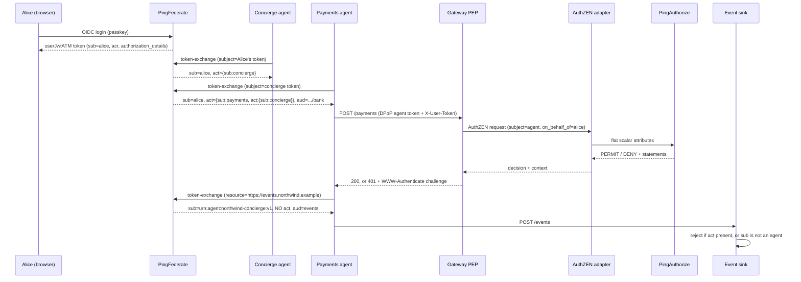

# Token exchange: nest and flatten

How the demo mints delegated agent tokens in PingFederate, and how those tokens are
evaluated by PingAuthorize through the AuthZEN adapter.

Written 2026-07-20 against the config in `demo/pingfederate/terraform/`,
`demo/pingfederate/data.zip`, `demo/coaz-pep/`, `authzen-adapter/`, and
`demo/pingauthorize/banking.deploymentpackage`.

---

## 1. Two token planes

One issuer mints two structurally different token shapes from the same token exchange
processor policy (`userToAgentTE`).

| | Banking plane (nest) | Events plane (flatten) |
|---|---|---|
| `sub` | `alice` — the human | `urn:agent:northwind-concierge:v1` — an agent |
| `act` | nested agent chain | absent |
| `aud` | `https://api.northwind.example/bank` | `https://events.northwind.example` |
| ATM | `attestJwtPmts` / `attestJwtAcct` / `attestJwtATM` | `eventsFlatJwtATM` |
| Lifetime | 720s | 120s |

Same issuer, same processor policy, same subject token. The RFC 8707 `resource`
parameter on the exchange request decides which shape comes back.

The consequence matters: `sub` means different things on the two planes. A resource
server that reads `sub` without first checking `aud` will treat an agent as if it were
the principal. `demo/event-sink/app.py` checks both.

---

## 2. Flow



---

## 3. The nest (delegation fold)

### Token processor

`demo/pingfederate/terraform/token-exchange.tf:24-48` — `subjectJwtProc`, a
`JWTTokenProcessor`. Validates the inbound PF token against `http://localhost:9080/pf/JWKS`
with `Expiry Tolerance = 0`.

```hcl
attribute_contract = {
  core_attributes     = [{ name = "sub" }]
  extended_attributes = [{ name = "acr" }, { name = "scope" }, { name = "act" }]
}
```

This is the only point where an inbound `act` re-enters PingFederate.

### Token exchange processor policy

`token-exchange.tf:51-80`. `actor_token_required = false`.

```hcl
attribute_contract = { extended_attributes = [{ name = "act" }] }

processor_mappings = [{
  subject_token_type      = "urn:ietf:params:oauth:token-type:access_token"
  subject_token_processor = { id = subjectJwtProc }
  attribute_contract_fulfillment = {
    "subject" = { source = { type = "SUBJECT_TOKEN" }, value = "sub" }
    "act"     = { source = { type = "SUBJECT_TOKEN" }, value = "act" }
  }
}]
```

The deployed XML in `data.zip` has `actorTokenType=""` and `actorTokenProcessorId=""`.
No RFC 8693 `actor_token` is ever presented. The actor is inferred from the
authenticating client, not from a second token.

### The mapping that mints `act`

`token-exchange.tf:110-116`:

```hcl
"act" = {
  source = { type = "TEXT" }
  value  = "{\"sub\":\"${var.agent_payments}\",\"act\":{\"sub\":\"${var.agent_concierge}\"}}"
}
```

Emitted chain: `sub=alice`, `act.sub=payments`, `act.act.sub=concierge`.

**This is a literal, not a computation.** The processor policy exposes the real inbound
`act` as `tepp.act`, and the policy carries it, but no mapping reads it. A payments token
minted directly from Alice's login token would still claim it was delegated via the
concierge.

### The one computed `act`

`entra-agents.tf:119-126` is the only live OGNL that builds `act`:

```hcl
"act" = {
  source = { type = "EXPRESSION" }
  value  = "\"{\\\"sub\\\":\\\"\" + #this.get(\"context.ClientId\") + \"\\\"}\""
}
```

Single level only. The in-file comment records why nothing deeper is dynamic:
referencing the inbound `act` in OGNL is rejected by PF 13.x. `ClientId` works because
it is an ordinary context attribute.

---

## 4. The flatten

### 4a. The designed OGNL — written, validated, not wired

`demo/pingfederate/terraform/flatten.tf:52-62`:

```hcl
root_actor_ognl = trimspace(<<-EOT
  (#a = (#this.get("act") == null ? "" : #this.get("act").getValue()),
   #k = "\"sub\":\"", #i = #a.lastIndexOf(#k),
   #i < 0 ? "" : #a.substring(#i + #k.length(), #a.indexOf("\"", #i + #k.length())))
EOT
)
```

How it would work: treat `act` as a raw JSON string, find the last occurrence of the
literal `"sub":"`, slice to the next quote. Because nesting puts the chain root deepest,
the last `"sub"` in serialization order is the root actor.

`local.root_actor_ognl` is referenced by no resource. Neither is `local.act_expression`
(`token-exchange.tf:87`), the dynamic nesting equivalent. Both are dead code kept as a
record of the intended derivation.

The approach is brittle to whitespace, key ordering, and escaping. That is why a
policy-driven alternative was built (section 4d).

### 4b. What actually deploys

`flatten.tf:64-83`:

```hcl
resource "pingfederate_oauth_access_token_mapping" "te_events" {
  context = {
    type        = "TOKEN_EXCHANGE_PROCESSOR_POLICY"
    context_ref = { id = pingfederate_oauth_token_exchange_processor_policy.user_to_agent.policy_id }
  }
  access_token_manager_ref = { id = pingfederate_oauth_access_token_manager.events.manager_id }

  attribute_contract_fulfillment = {
    "sub"       = { source = { type = "TEXT" },    value = var.agent_concierge }
    "client_id" = { source = { type = "CONTEXT" }, value = "ClientId" }
    # No "act" fulfillment.
  }
```

The flatten is achieved by two things:

1. `sub` is set to the literal `urn:agent:northwind-concierge:v1`.
2. `eventsFlatJwtATM`'s attribute contract (`flatten.tf:38-44`) has only `sub` and
   `client_id`. There is no `act` slot, so no chain can be emitted regardless of input.

`tepp.act` is carried through the processor policy and then discarded.

Deployed form, from `data.zip` / `oauth-authz-server-settings.xml`:

```xml
<urn:UserKeyToAccessTokenMapping
    contextId="urn:ietf:params:oauth:grant-type:token-exchange|userToAgentTE"
    tokenManagerId="eventsFlatJwtATM">
  <urn1:AttributeMap Name="sub" Type="Text">
    <urn1:ValueText>urn:agent:northwind-concierge:v1</urn1:ValueText>
  </urn1:AttributeMap>
  <urn1:AttributeMap Name="client_id" Type="Context">
    <urn1:ValueText>context.ClientId</urn1:ValueText>
  </urn1:AttributeMap>
  <urn1:TokenAuthorizationIssuanceCriteria>
    <urn1:TokenAuthorizationIssuanceCriterion ErrorResult="attestation_validation_failed">
      <urn1:ExprText>@com.pingidentity.ps.oidf.servlet.clientregistration.utils.ClientAttestationUtils@validateClientAttestation(#this)</urn1:ExprText>
    </urn1:TokenAuthorizationIssuanceCriterion>
  </urn1:TokenAuthorizationIssuanceCriteria>
</urn:UserKeyToAccessTokenMapping>
```

### 4c. Selection and access control

Client side, `demo/task-agent/identity.py:384-433`:

```python
edata = {
    "grant_type": "urn:ietf:params:oauth:grant-type:token-exchange",
    "subject_token": subject_token,
    "subject_token_type": "urn:ietf:params:oauth:token-type:access_token",
    "resource": EVENTS_AUDIENCE,   # selects the events ATM, hence the flatten mapping
    "client_id": agent_id,         # public client; attestation is the credential
}
```

Called from `demo/task-agent/app.py:245` after a successful payment.

`resource` is matched against `eventsFlatJwtATM`'s `resource_uris`
(`["https://events.northwind.example"]`).

Who is allowed to flatten is controlled by one setting —
`generated_adopt.tf:82`, on the payments client only:

```hcl
restrict_to_default_access_token_manager = false
```

Concierge (`generated_agents.tf:82`), account (`generated_agents.tf:173`), and both Entra
clients (`entra-agents.tf:150`) are `true`. They cannot reach the flatten ATM even if
they send the `resource` parameter. That boolean is the entire access control on the
flatten.

Enforcement at the receiving end: `demo/event-sink/app.py:48` `_verify_flattened()`
rejects any token that still carries `act`, or whose `sub` is not an agent URN
(lines 79-92).

### 4d. Policy-governed flatten — built and tested, not connected

`demo/pingfederate/terraform/paz-audience-flatten.md:40-57` records the alternative.

A PingAuthorize policy in the sibling repo `dphhyland/idp-paz-simplifid-policy`
(`pap-profile/policies/AuthZEN.snapshot`) adds a `TokenExchange` trust framework domain
and an "Event-endpoint flatten governance" policy:

- combining algorithm `DenyUnlessPermit`
- condition: `requestedAudience == https://events.northwind.example`
- rule permits when `requestingClient == urn:agent:northwind-payments:v1`

Decision tests recorded: events + payments → PERMIT, events + account → DENY, a normal
banking request with no audience → NOT_APPLICABLE. The last case works because the
audience attribute has `defaultValue=""`, so the rule cannot regress the gateway plane
under `DenyOverrides`.

The intended split, quoted from the doc: the agent *proposes* the root actor, and
PingAuthorize *governs* the flatten by audience. `te_events` still uses the TEXT literal;
this is target state, not current state.

---

## 5. Access token managers

All JWT ATMs use `JwtBearerAccessTokenManagementPlugin`, RS256, centralized signing key,
`typ: at+jwt`.

| ATM | Source | Contract | `aud` | TTL |
|---|---|---|---|---|
| `userJwtATM` | data.zip only | `sub, acr, auth_time, name, client_id` | — | 28800 |
| `attestJwtATM` | data.zip only | `sub, act, client_id` | — | 720 |
| `attestJwtPmts` | `generated_adopt.tf:289` | `sub, act, client_id` | `.../bank` | 720 |
| `attestJwtAcct` | `generated_adopt.tf:96` | `sub, act, client_id` | `.../bank` | 720 |
| `attestJwtEntra` | `entra-agents.tf:28` | `sub, act, client_id` | `.../bank` | 720 |
| `eventsFlatJwtATM` | `flatten.tf:17` | `sub, client_id` | `.../events` | 120 |

`acr` appears only on `userJwtATM`, the human login plane. It reaches the PDP via the
separate `X-User-Token` header, not via the agent token.

`userJwtATM` is not Terraform-managed — it exists only in `data.zip` — so it can drift
silently.

---

## 6. Attestation

All agent clients are `client_auth = { type = "NONE" }` with `grant_types = ["TOKEN_EXCHANGE"]`.
There is no client secret. The credential is client attestation.

`variables.tf:56-60` and `token-exchange.tf:91-95` define the criterion:

```hcl
attestation_criterion = "@${var.attestation_utils_class}@validateClientAttestation(#this)"
```

resolving to:

```
@com.pingidentity.ps.oidf.servlet.clientregistration.utils.ClientAttestationUtils@validateClientAttestation(#this)
```

Applied as a token authorization issuance criterion on `te_payments`, `te_account`,
`te_entra`, `te_events`, and the three `client_credentials` mappings, with
`ErrorResult="attestation_validation_failed"`.

Implementation ships as a prebuilt jar, `demo/pingfederate/pf-oidf-modules.jar`. It reads
the `OAuth-Client-Attestation` and `DPoP` headers and verifies the attester-signed JWT and
its `cnf` binding. Trusted attester keys are in
`demo/pingfederate/oidf-mock-attesters.json` (ES256 P-256 JWKs keyed by client id).

`signupTE` / `te_signup` and the ROPC, CIBA, and HTML-form mappings carry no attestation
criterion.

A second jar, `pf.plugins.pf-rar-paz-plugin.jar`, is an `AuthorizationDetailProcessor`
(`rarPazProc`) that calls PingAuthorize from the authorization endpoint for
`payment_initiation` RAR. It is not in the token exchange path.

---

## 7. PDP integration

### Pipeline

```
JWT claims
  -> PEP decodes and selects claims
  -> AuthZEN request (subject / action / resource / context)
  -> authzen-adapter flattens to scalar attributes
  -> PingAuthorize governance engine
  -> Symphonic rules read attributes via "request" resolvers
  -> decision + statements
  -> adapter converts statements to AuthZEN context
  -> PEP converts context to an HTTP or JSON-RPC challenge
```

PingAuthorize never sees the token, the AuthZEN object graph, or the actor chain. It sees
about 14 flat scalar attributes computed by the adapter.

### Claim extraction

`demo/coaz-pep/cmd/coaz-pep/jwt.go:153-172`:

```go
func actorSub(claims map[string]any) string {
	act := claims["act"]
	if s, ok := act.(string); ok {          // PF's JWT ATM emits object claims as strings
		var decoded map[string]any
		if json.Unmarshal([]byte(s), &decoded) == nil {
			act = decoded
		}
	}
	if m, ok := act.(map[string]any); ok {
		sub, _ := m["sub"].(string)
		return sub
	}
	return ""
}
```

It returns `act.sub` and stops. `act.act` is never read by any PEP and never reaches
PingAuthorize.

The string-or-object handling exists because PingFederate's JWT ATM serializes
object-valued claims as strings. `claimsForCEL` (`jwt.go:135-151`) does the same re-parse
so `token.act.sub` resolves in CEL regardless of encoding.

### Subject inversion

`demo/coaz-pep/cmd/coaz-pep/pep.go:317-338`:

```go
agent := act
if agent == "" { agent = clientID }
if agent == "" { agent = "unknown-agent" }

authzenReq := map[string]any{
	"subject": map[string]any{
		"type":     "agent",
		"identity": agent,
		"properties": map[string]any{
			"on_behalf_of": sub,
			"agent_type":   "ai_assistant",
			"scope":        scope,
			"client_id":    clientID,
		},
	},
	"action":   map[string]any{"name": m.action},
	"resource": map[string]any{"type": m.rtype, "id": m.rid, "properties": m.rprops},
	"context":  m.ctx,
}
```

In the token, `sub` is Alice and `act.sub` is the agent. In the AuthZEN request the agent
becomes the subject and Alice is demoted to `subject.properties.on_behalf_of`. The
delegation relationship survives only as that pair of fields.

Note the key is `identity`, not the AuthZEN 1.0 `id`. The adapter accepts both —
`authzen-adapter/authzen-pdp.go:32-59`.

The MCP edge builds the same shape declaratively via CEL, so the same policies govern both
edges. `demo/mcp-server/server.py:160-172`:

```python
_AGENT_EXPR = ("has(token.act) ? token.act.sub : "
               "(has(token.client_id) ? token.client_id : 'unknown-agent')")
```

### Context injection

Two different tokens are merged into one context. `pep.go:294-314`:

```go
uclaims := jwtClaims(headers["x-user-token"])
m.ctx["user_scope"] = scopeString(uclaims)
m.ctx["token_aud"]  = audString(claims)      // from the AGENT token
m.ctx["user_acr"]   = strClaim(uclaims, "acr")
if ad, ok := uclaims["authorization_details"]; ok && ad != nil {
	m.ctx["authorization_details"] = ad
	if amt, cred, found := consentedPayment(ad); found {
		m.ctx["consented_amount"] = amt
		m.ctx["consented_creditor"] = cred
	}
}
```

`token_aud` comes from the agent token. `user_scope`, `user_acr`, and
`authorization_details` come from Alice's `X-User-Token`.

Both PEPs must inject this identically. The in-code comment states the failure mode: a
payment authorized at the MCP edge gets re-challenged at the bank API edge because the RAR
context is missing, the payment fails downstream, and the flow loops on step-up.

`consentedPayment` (`pep.go:473-491`) considers only the first `payment_initiation` entry.

### Adapter flattening

`authzen-adapter/authzen-pdp.go:513-534` emits flat scalars alongside the nested
JSON-string attributes. Only the flat scalars are used by the banking policy.

```go
pdpPayload.Attributes["actionName"]   = evalRequest.Action.Name
pdpPayload.Attributes["resourceType"] = evalRequest.Resource.Type
pdpPayload.Attributes["resourceId"]   = evalRequest.Resource.ID
pdpPayload.Attributes["agentId"]      = evalRequest.Subject.ID
// ... to_account, onBehalfOf, agentType, then context scalars
```

### Precomputed booleans

`authzen-pdp.go:583-604`:

```go
// The embedded PDP (PingAuthorize 11.0.0.2) cannot compare two attributes to each other,
// so we do the amount/account match here and hand the policy plain booleans.
amtOK  = cap > 0 && amt <= cap
credOK = cred != "" && toAcct == cred
pdpPayload.Attributes["rar_amount_ok"]   = strconv.FormatBool(amtOK)
pdpPayload.Attributes["rar_creditor_ok"] = strconv.FormatBool(credOK)
```

The RAR consent comparison happens in Go, not in policy. This is a product limitation
worked around, not a design preference. `authorization_details` is forwarded to the PDP
but no rule consumes it.

The same pattern applies to the mDL gate (`:606-633`): the adapter calls the proofing
directory and hands the policy `identity_proofing_present` as `"true"` / `"false"`.

Attributes sent but matched by no rule: `agentId`, `agentType`, `channel`, `resourceType`,
`resourceId`, `authorization_details`, `consented_amount`, `consented_creditor`, and all
four nested JSON-string attributes.

---

## 8. Policy

### Lineage

Live package: `banking-mdl-gate` (`demo/pingauthorize/banking.deploymentpackage`,
snapshot `0f166055-5682-4bf4-bd24-26a354eb0f04`, applicationVersion 11.1.0.0), root entity
`Global Decision Point`.

Predecessor: `banking-staff-approval`
(`banking.deploymentpackage.pre-mdl-gate.bak`, snapshot `e37ad2da-...`), root entity
`Agentic Banking Authorization`.

Source snapshot is checked in as `demo/pingauthorize/banking-mdl-gate.snapshot`.

Authoring on the wrong lineage silently deletes the mDL gate, so changes must target
`banking-mdl-gate` and be verified by decision test.

### Structure

```
PolicySet "Global Decision Point"        DenyOverrides
  └── Policy "Agentic Banking Authorization"   DenyOverrides, evaluateAll: false
        └── 7 rules, no targets, no policy-level condition
```

### Trust framework

13 attributes, all `attributeResolverType: "request"` with `parametersKey == name` and
`condition: {"empty": {}}` — direct reads of the adapter's flat attributes.

| Attribute | Type | Default |
|---|---|---|
| `actionName` | STRING | `""` |
| `amount` | NUMBER | `0` |
| `currency` | STRING | `""` |
| `onBehalfOf` | STRING | `""` |
| `to_account` | STRING | `""` |
| `token_aud` | STRING | `""` |
| `user_acr` | STRING | `""` |
| `user_scope` | STRING | `""` |
| `rar_amount_ok` | STRING | `"false"` |
| `rar_creditor_ok` | STRING | `"false"` |
| `identity_proofing_present` | STRING | `"true"` |
| `purpose` | STRING | `""` |
| `consent_covered` | STRING | `"false"` |

Two fail directions coexist deliberately. `rar_*_ok` and `consent_covered` default false,
so missing consent fails closed to a step-up. `identity_proofing_present` defaults true,
so the origination rule is a no-op while the gate switch is off.

One PIP — `ServiceDefinition "ConsentDirectory"`, RESTful GET, no auth, 2000 ms timeout,
2 retries with backoff:

```
https://proofing-directory-staging.up.railway.app/consents/check
    ?subject={{onBehalfOf}}&creditor={{to_account}}&amount={{amount}}&currency={{currency}}
```

Resolves `consent_covered` from `$.covered`, and fires only when
`actionName == "make_payment"`.

`onBehalfOf` and `to_account` are used only to build this URL. No rule reads either
directly.

### Rules

1. **Permit banking actions** — unconditional permit when `actionName` is one of
   `list_accounts`, `get_balance`, `open_account`, `make_payment`, `access_mcp`.

2. **Deny over-limit agent payment** — `actionName == "make_payment" AND amount > 2000`.

3. **Permit payment authorization** — `purpose == "payment_initiation"`. This is the PF
   token issuance plane (via `rarPazProc`), not the gateway plane.

4. **Deny over-limit payment authorization** — `purpose == "payment_initiation" AND amount > 2000`.

5. **Require step-up for large payment** — deny plus the `step-up-required` statement:

   ```
   actionName == "make_payment"
   AND amount > 500
   AND NOT (amount > 2000)
   AND NOT (
        (rar_amount_ok == "true" AND rar_creditor_ok == "true")     # (a) RFC 9396 RAR
     OR (user_acr == "urn:northwind:loa:staff-approval"
         AND user_scope CONTAINS "banking:payments:transfer")       # (b) CIBA staff channel
     OR (consent_covered == "true")                                 # (c) consent directory
   )
   ```

   Three independent approval channels. (a) is the interactive channel, where the payment
   instruction rides in the token as RAR. (b) is the autonomous channel — PF cannot attach
   RAR to an ROPC or CIBA-minted token, so `acr` plus the elevated scope is that channel's
   evidence. (c) is the consent directory lookup.

   This is the only rule that reads `acr` or scope.

   The policy's own description labels (c) as demo-grade: the BFF writes the consent row
   after a passkey ceremony that signs a random challenge, not the payment. The signature
   does not cover the transaction and the row can be produced without it. It is not
   non-repudiable and would not satisfy PSD2 RTS Art.5 dynamic linking. See
   `demo/TRANSACTION-AUTHORIZATION.md`.

6. **Deny wrong-audience token** — `token_aud != "" AND token_aud != "https://api.northwind.example/bank"`,
   plus the `denied-reason` statement. The `!= ""` guard makes the rule a no-op when the
   audience is absent, so it cannot regress other flows under `DenyOverrides`.

7. **Require identity proofing for origination** — `actionName == "open_account" AND
   identity_proofing_present != "true"`, plus the `identity-proofing-required` statement.

Thresholds are 500 (step-up band) and 2000 (hard deny), duplicated across the gateway
plane (`actionName`) and the issuance plane (`purpose`).

### What the policy does not do

- No rule references the actor chain. No `agentId`, no `agentType`, no `act`, no `act.act`.
  Agent identity is carried all the way to the PDP and never tested — any agent gets the
  same decision.
- No rule reads `authorization_details`. The RAR is reduced to two adapter-computed
  booleans.
- No rule reads `channel`, `resourceType`, or `resourceId`.

---

## 9. Obligations and challenges

Three statement templates, all `obligatory: true`, `appliesTo: "DENY"`,
`appliesIf: "FINAL_DECISION_MATCHES"`:

```json
{"code": "step-up-required",
 "payload": "{\"step_up\": true, \"scope\": \"banking:payments:transfer\", \"message\": \"This payment needs your approval. Please sign in to approve it.\"}"}

{"code": "identity-proofing-required",
 "payload": "{\"proofing\": true, \"doctype\": \"org.iso.18013.5.1.mDL\", \"message\": \"Present your mobile Driver's Licence (mDL) to open an account.\"}"}

{"code": "denied-reason",
 "payload": "{\"status\": 403, \"message\": \"invalid_audience\", \"detail\": \"This access token was minted for a different audience and cannot be used at the bank API (RFC 8707).\"}"}
```

Because statements only apply to DENY, a step-up is modelled as deny-plus-obligation. The
PEP reinterprets it as a challenge rather than a refusal.

### Adapter: statements to context

`authzen-adapter/authzen-pdp.go:778-834` maps `step-up-required` to
`step_up_required` / `step_up_scope` / `reason`, and `identity-proofing-required` to
`identity_proofing_required` / `identity_proofing_doctype`. `denied-reason` is not matched
by code, so its whole payload string surfaces in `reason` via the fallback chain
(`:821-831`).

The raw governance engine body is retained as `RawPDP` for the demo UI only
(`:105-113`); it never goes on the wire.

### PEP: context to challenge

Carrier struct, `pep.go:498-505`:

```go
type pepOutcome struct {
	Decision        bool
	Reason          string
	StepUp          bool
	StepUpScope     string
	IdentityReq     bool
	IdentityDoctype string
}
```

REST edge precedence: identity proofing, then step-up, then flat deny.

```go
// pep.go:351-365 — mDL
"WWW-Authenticate": `Bearer error="identity_verification_required", doctype="` + doctype + `"`

// pep.go:370-384 — RFC 9470 scope step-up
"WWW-Authenticate": `Bearer error="insufficient_scope", scope="` + scope + `"`
```

Otherwise HTTP 403 with `X-PDP-PEP`, `X-PDP-Decision`, `X-PDP-Action`, `X-PDP-Reason`
(CR/LF sanitized at `:102-104`).

On permit, `pep.go:139-158` stamps the delegation identity onto the upstream request:
`X-Auth-Principal` = `sub`, `X-Auth-Agent` = `act.sub`, `X-Auth-Scope`.

PDP unreachable is fail-closed: HTTP 503, `codes.Unavailable` (`pep.go:341-345`).

MCP edge: the same advice becomes JSON-RPC errors at HTTP 200, per the AuthZEN MCP
profile. `demo/coaz-pep/coaz/engine.go:111-148` encodes
`identity_verification_required doctype=...` and `insufficient_scope scope=...` into the
error message so the client can relay a challenge rather than narrate a denial. Batch
folding takes the first non-permit (`engine.go:230-235`).

---

## 10. Tests

No decision-test fixtures are committed in this repo. Evidence exists in two places.

The banking package snapshot message records 9 of 9 passing:

> covered -> permit; wrong creditor / over-cap -> deny + step-up; RAR -> permit;
> staff -> permit; small -> permit; >2000 -> deny; open_account without proofing -> DENY
> + identity-proofing-required; with proofing -> permit.

It also records that authoring was done on the `banking-mdl-gate` lineage so the mDL gate
is preserved, verified by decision test rather than assumed.

The flatten policy tests are recorded in
`demo/pingfederate/terraform/paz-audience-flatten.md:50-52` and live in the sibling repo.

Go unit tests cover the COAZ mapping engine only — `demo/coaz-pep/coaz/coaz_test.go`
tests request construction and JSON-RPC error semantics, not policy content.

---

## 11. Known gaps

1. **The flatten is a constant, not a computation.** `sub` is the literal concierge URN
   regardless of the incoming chain. If payments were invoked through a different root,
   the flattened token would still name the concierge.

2. **The nest is also a constant.** All banking-plane `act` values are literals encoding
   an assumed concierge to payments/account topology. The real inbound `act` is available
   and unused.

3. **The actor chain is truncated to one hop before policy.** PF mints `act.act`; no PEP
   reads it; no rule references it. The chain root is recovered only by the unwired OGNL
   in `flatten.tf`, and only for audience flattening.

4. **Agent identity reaches the PDP and is never evaluated.** `agentId` and `agentType`
   are sent by the adapter and appear in the decision feed, but match zero rules.

5. **Authorization to flatten is one Terraform boolean**, not policy. The PingAuthorize
   policy that would govern it is authored and tested but not connected.

6. **The consent decision is made in Go**, because PingAuthorize 11.0.0.2 cannot compare
   two attributes to each other. The policy compares adapter-computed booleans to string
   constants.

7. **Rule 5 disjunct (c) is demo-grade only** — app-asserted consent, not non-repudiable.
   Target state is CIBA plus RAR.

8. **`userJwtATM` is not Terraform-managed** — it exists only in `data.zip`, so it can
   drift from the declared config without detection.
